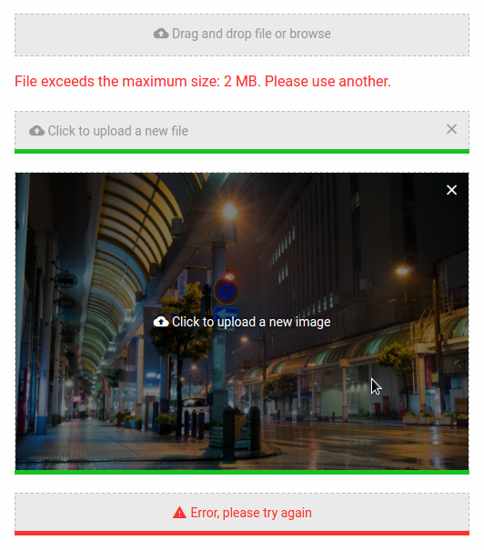

# VulcanUp

[](https://badge.fury.io/js/vulcanup)

jQuery plugin to upload single files and preview images using [blueimp/jQuery-File-Upload](https://github.com/blueimp/jQuery-File-Upload).



See [demo](./demo) for a quick start.

## Install

To install the plugin with [Browserify](http://browserify.org) or [Webpack](https://webpack.github.io):

```bash
$ npm install --save-dev vulcanup
```

To install the styles with [SASS](http://sass-lang.com), include the path:

```
./node_modules/vulcanup/src/scss
```

And import (after you have changed the variables):

```sass
@import 'vulcanup';
```

Or you can just use the built files:

- [vulcanup.min.css](https://raw.githubusercontent.com/vulcan-estudios/vulcanup/master/dist/vulcanup.min.css)
- [vulcanup.min.js](https://raw.githubusercontent.com/vulcan-estudios/vulcanup/master/dist/vulcanup.min.js)

The plugin dependencies are:

- [jquery](http://jquery.com)
- [blueimp/jQuery-File-Upload](https://github.com/blueimp/jQuery-File-Upload), its dependencies and its addon [jquery.fileupload-process.js](https://github.com/blueimp/jQuery-File-Upload/blob/master/js/jquery.fileupload-process.js)
- [materialdesignicons.com](https://materialdesignicons.com) (this can be changed)

An example of installation with built files is in the [demo](./demo).

## Configuration

By default the plugin sends an XHR type `POST` to the endpoint `/api/files` with the file as `file` parameter.

The plugin by default expects the server to return a response with the following JSON `{ files: [ { url: String } ] }` to know the upload was successful. In the demo I used [aguidrevitch/jquery-file-upload-middleware](https://github.com/aguidrevitch/jquery-file-upload-middleware) which returns a similar object.

The icons by default are configured with [materialdesignicons.com](https://materialdesignicons.com) but you have to install it.

## Use

You can see a complete demo in [demo folder](./demo). Install dependencies and start the server.

See [JavaScript API](./JS.md) for details of configuration.

See [SASS variables][./SASS.md] for details of configuration.

## License

[MIT](./LICENSE)
